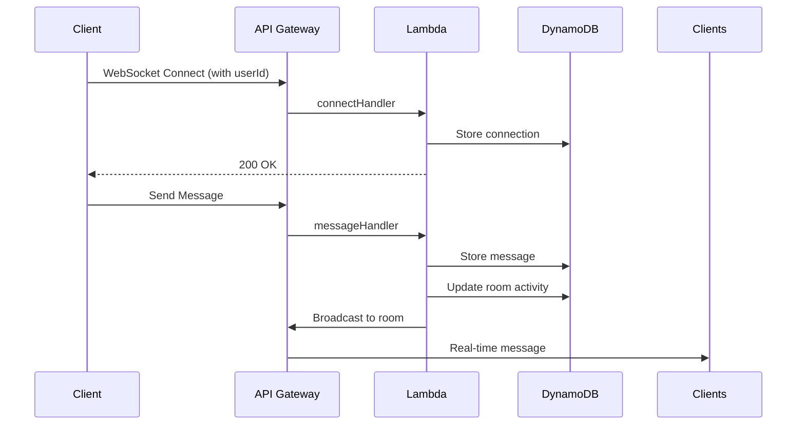

## Real-Time Chat Backend (AWS Lambda)

This serverless backend powers a real-time chat application using AWS Lambda, API Gateway, and DynamoDB. It handles WebSocket connections for real-time messaging and HTTP endpoints for room management.

---

### 🚀 Features
- Real-time messaging via WebSockets
- Location-based chat room discovery
- Room creation/management
- User presence tracking
- Automatic room cleanup
- Typing indicators
- Scalable serverless architecture

---

### ⚙️ Environment Variables

| Variable              | Description                                 | Required |
|-----------------------|---------------------------------------------|----------|
| `CHAT_ROOMS_TABLE`    | DynamoDB table for chat rooms               | No (default: `ChatRooms`) |
| `CONNECTIONS_TABLE`   | DynamoDB table for active connections       | No (default: `Connections`) |
| `MESSAGES_TABLE`      | DynamoDB table for chat messages            | No (default: `Messages`) |
| `WEBSOCKET_ENDPOINT`  | WebSocket API endpoint (without `wss://`)   | **Yes** |

---

### 🏗️ DynamoDB Table Schemas

**1. ChatRooms Table (`CHAT_ROOMS_TABLE`)**
```javascript
{
  id: "string",             // Room ID (UUID)
  location: {               // Geo location
    latitude: "number",     // Latitude
    longitude: "number"     // Longitude
  },
  roadName: "string",       // Nearby road name
  radius: "number",         // Room radius in meters
  creator: "string",        // User ID of creator
  participants: ["string"], // Array of user IDs
  lastActivity: "number",   // Timestamp of last activity
  status: "string",         // "active" or "closed"
  roomType: "string",       // "public" or "private"
  maxParticipants: "number" // Max users allowed
}
```

**2. Connections Table (`CONNECTIONS_TABLE`)**
```javascript
{
  connectionId: "string",   // WebSocket connection ID
  userId: "string",         // Authenticated user ID
  roomId: "string",         // Current room ID (optional)
  connectedAt: "number"     // Connection timestamp
}
```

**3. Messages Table (`MESSAGES_TABLE`)**
```javascript
{
  roomId: "string",         // Room ID (partition key)
  messageId: "string",      // Message ID (sort key)
  id: "string",             // Duplicate of messageId
  text: "string",           // Message content
  createdAt: "string",      // ISO timestamp
  userId: "string",         // Sender's user ID
  userName: "string",       // Sender's display name
  userIcon: "string",       // Sender's avatar URL
  userColor: "string",      // Sender's theme color
  ttl: "number"             // Expiration timestamp (30 days)
}
```

---

### 🌐 API Endpoints

**WebSocket API (`wss://...`)**
- **Actions:**
  - `join-room`: Join a chat room
  - `send-message`: Send message to room
  - `user-typing`: Broadcast typing indicator
  - `room-info`: Request room information
  - `close-room`: Close active room (creator only)

**HTTP API**
1. **Create Room**  
   `POST /rooms`  
   ```json
   {
     "userId": "user123",
     "latitude": 37.7749,
     "longitude": -122.4194,
     "roadName": "Main Street",
     "roomType": "public",
     "maxParticipants": 15
   }
   ```

2. **Search Nearby Rooms**  
   `GET /rooms?latitude=37.7749&longitude=-122.4194&roomType=public`

3. **Join Room**  
   `POST /rooms/join`  
   ```json
   {
     "roomId": "room-uuid",
     "userId": "user123"
   }
   ```

4. **Close Room**  
   `POST /rooms/close`  
   ```json
   {
     "roomId": "room-uuid",
     "userId": "creator-user-id"
   }
   ```

---

### ⚡️ Scheduled Cleanup
- Automatically closes inactive rooms after **30 minutes**
- Triggered by CloudWatch Event (configure in serverless.yml):
  ```yaml
  events:
    - schedule: rate(10 minutes)
  ```

---

### 🛠️ Deployment
1. **Create DynamoDB Tables**:
   ```bash
   aws dynamodb create-table \
     --table-name ChatRooms \
     --attribute-definitions AttributeName=id,AttributeType=S \
     --key-schema AttributeName=id,KeyType=HASH \
     --billing-mode PAY_PER_REQUEST

   aws dynamodb create-table \
     --table-name Connections \
     --attribute-definitions AttributeName=connectionId,AttributeType=S \
     --key-schema AttributeName=connectionId,KeyType=HASH \
     --billing-mode PAY_PER_REQUEST
   
   aws dynamodb create-table \
     --table-name Messages \
     --attribute-definitions \
         AttributeName=roomId,AttributeType=S \
         AttributeName=messageId,AttributeType=S \
     --key-schema \
         AttributeName=roomId,KeyType=HASH \
         AttributeName=messageId,KeyType=RANGE \
     --billing-mode PAY_PER_REQUEST
   ```

2. **Set Environment Variables**:
   ```env
   WEBSOCKET_ENDPOINT=abcdef123.execute-api.us-east-1.amazonaws.com/prod
   # Optional overrides:
   # CHAT_ROOMS_TABLE=MyChatRooms
   # CONNECTIONS_TABLE=MyConnections
   # MESSAGES_TABLE=MyMessages
   ```

3. **Deploy with Serverless Framework**:
   ```bash
   npm install -g serverless
   serverless deploy
   ```

---

### 🔍 Testing WebSocket Events
Use `wscat` for manual testing:
```bash
npm install -g wscat
wscat -c wss://YOUR_WEBSOCKET_ENDPOINT?userId=testuser
```

**Sample Events:**
```json
{"action": "join-room", "roomId": "room-123", "userName": "TestUser"}
{"action": "send-message", "roomId": "room-123", "message": "Hello world!"}
{"action": "user-typing", "roomId": "room-123", "userName": "TestUser"}
```

---

### 🚨 Error Handling
The API returns appropriate HTTP status codes:
- `400` - Invalid request/missing parameters
- `403` - Unauthorized room closure
- `404` - Room not found
- `500` - Internal server error

Errors are logged to CloudWatch with detailed context.

---

### 📊 Monitoring
- **CloudWatch Metrics**:
  - WebSocket connections
  - Message throughput
  - Room activity
- **X-Ray Tracing**:
  - Enable in serverless.yml for request tracing
- **CloudWatch Logs**:
  - All Lambda executions logged with DEBUG info

---

### 🔄 Flow Diagram


---

### 🔧 Dependencies
- AWS SDK
- UUID (v4)
- Serverless Framework (for deployment)

---

### 📜 License
MIT License - see [LICENSE](LICENSE) for details.