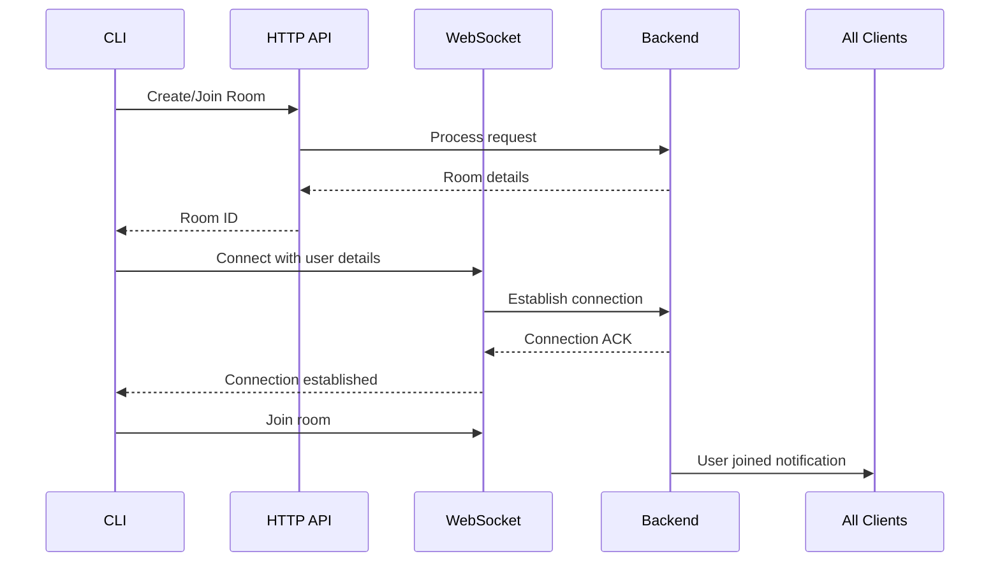

## Real-Time Chat CLI Tester

This CLI tool allows you to test and interact with the real-time chat backend. It simulates user behavior by creating/joining chat rooms, sending messages, and managing rooms via WebSocket and HTTP APIs.

---

### 🚀 Features
- Multiple operating modes: `create`, `join`, `close`, and `auto`
- Real-time WebSocket communication
- Room management operations
- User simulation with randomized profiles
- Typing indicators
- Interactive chat interface
- Cross-platform support

---

### ⚙️ Prerequisites
1. Node.js v16+
2. NPM

---

### 📦 Installation
```bash
npm install -g chat-cli-tester
# OR
npx chat-cli-tester [mode] [roomId]
```

---

### 🔧 Configuration
Set environment variables in your `.env` file:
```env
HTTP_API_URL="https://your-api-endpoint.com"
WEBSOCKET_URL="wss://your-websocket-endpoint.com"
```

---

### 🕹️ Usage
```bash
# Auto mode (default): Finds or creates a room automatically
chat-cli-tester

# Create mode: Creates a new room
chat-cli-tester create

# Join mode: Joins specific room
chat-cli-tester join room-123

# Close mode: Closes a room (creator only)
chat-cli-tester close room-123
```

---

### 🧪 Testing Workflows

#### 1. Room Creation
```bash
chat-cli-tester create
```
- Creates new chat room
- Sets you as room creator
- Establishes WebSocket connection

#### 2. Room Joining
```bash
chat-cli-tester join room-123
```
- Joins existing room
- Notifies other participants
- Enables real-time messaging

#### 3. Auto Mode
```bash
chat-cli-tester
```
1. Searches for available rooms
2. Creates new room if none found
3. Joins selected room

---

### 💬 Chat Interface Commands
Once in a chat room:
```
💬 Start chatting! Commands:
  /exit - Quit chat
  /close - Close room (creator only)
  /info - Show room info

[You] > Hello world! 👋
```

---

### 🌈 User Simulation
Each instance generates a unique user profile:
```js
USER_ID: `user-${Date.now()}-${random}`
USER_NAME: `User-${random}`
USER_ICON: `https://robohash.org/${USER_ID}`
USER_COLOR: Creator (#FFFF00) or Participant (#00FFFF)
```

---

### 🔌 Connection Flow


---

### � Error Handling
The CLI provides clear error messages:
- ❌ WebSocket connection errors
- ❌ API request failures
- ⚠️ Permission errors (e.g., non-creator closing room)
- 🔌 Graceful disconnection handling

---

### 🧪 Testing Scenarios
1. **Multiple Participants**:  
   Open 3+ terminals to simulate group chat
   
2. **Room Capacity Testing**:  
   `create` mode with `maxParticipants: 2`

3. **Connection Resilience**:  
   Disconnect/reconnect during chat

4. **Cross-room Communication**:  
   Join different rooms in separate terminals

---

### 📦 Dependencies
- `ws`: WebSocket implementation
- `uuid`: Message ID generation
- `colors`: Terminal text styling
- `readline`: Interactive input handling
- `https`: HTTP API requests

---

### 🚪 Exit Procedure
Use `/exit` command or `CTRL+C` to:
1. Leave room
2. Close WebSocket connection
3. Remove user from participants list
4. Notify other users

---

### 📝 Example Output
```
👤 You are: user-1691345678123-742 (Creator)
👤 Name: User-742, Color: #FFFF00
✅ Created room: room-abc123
✅ Joined room: room-abc123
✅ WebSocket Connected

💬 Start chatting! Commands:
  /exit - Quit chat
  /close - Close room (creator only)
  /info - Show room info

[You] > Hello everyone!

👉 User-319 joined the room

[User-319] > Hi there!
✍️  User-319 is typing...
```